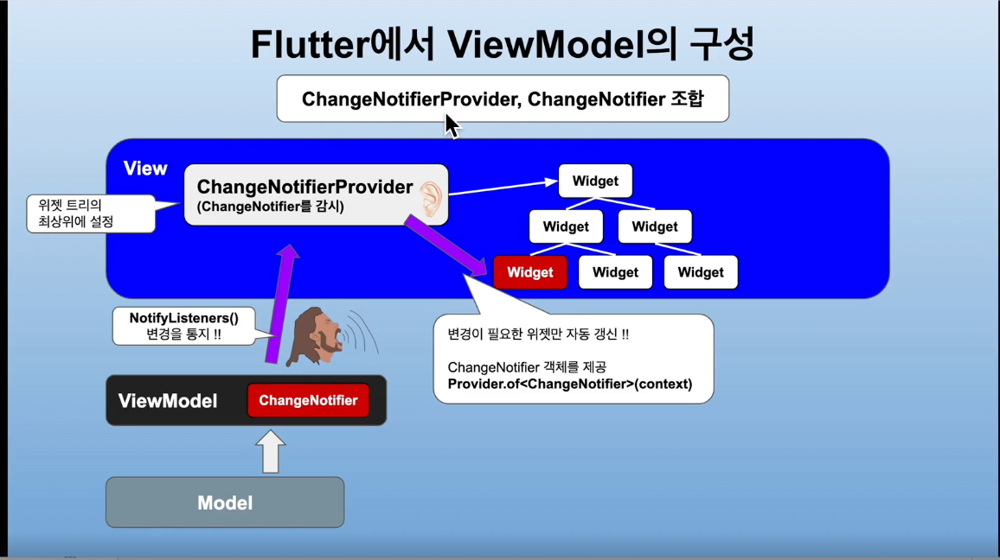
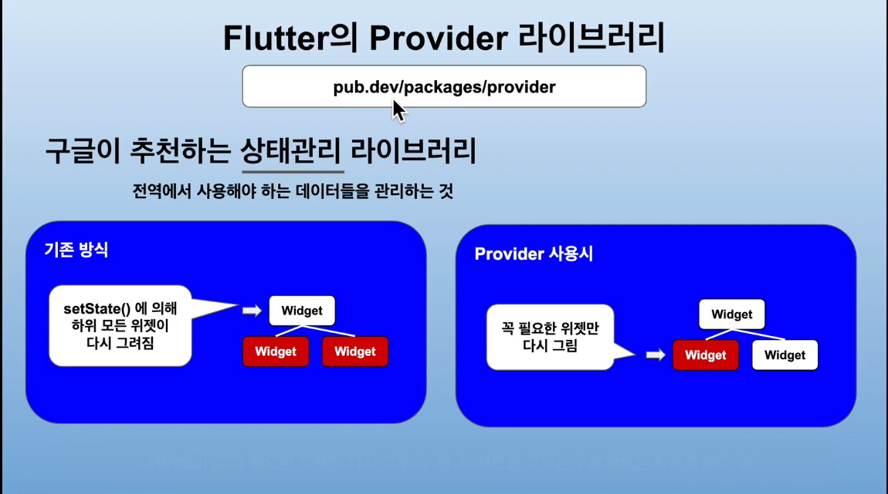

# find_mask

마스크 찾기 - Flutter 응용 강의 수강

## MVVM 패턴

: Model - View - ViewModel

View : 사용자에게 보여지는 UI 부분 (사용자의 동작이나 각종 처리는 ViewModel에 의뢰)

ViewModel : Model을 View에 표시하기 위한 처리를 하는 부분

a. View로부터 의뢰 받은 처리를 Model에 의뢰

b. Model로부터 처리 결과를 View에 통지 (자동갱신)

Model : 데이터와 데이터를 처리하는 부분 (비즈니스 로직)

a. ViewModel로 부터 의뢰받은 로직을 처리

b. DB,File,Web 으로 부터 데이터를 가져오거나 전송 등 (Repository)

## Flutter에서 ViewModel의 구성

1. ChangeNotifierProvider, ChangeNotifier 조합

a. ChangeNotifierProvider : 변경을 감지. 위젯 트리의 최상위에 설정 (NotifyListeners())

-> Flutter의 Provider 라이브러리에서 제공 (구글이 추천하는 상태관리 라이브러리)

: Inherited widget 이라는 거을 사용해서 import를 할 수 있지만 매번 해야하므로 번거로움

setState를 사용하지 않아도 됨!!

